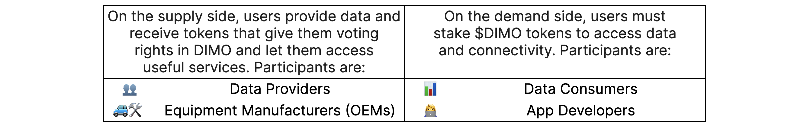

# What is DIMO

DIMO is an open-source protocol that leverages web3 technology to connect data producers and consumers. The initial focus of DIMO is to provide an easy to use solution for vehicle owners to collect, use, and earn rewards on the data that their cars generate. The DIMO platform is a fair, neutral, and open marketplace on which developers can build robust applications.

A more detailed overview of how these groups interact with DIMO and how other entities like regulators and data unions come into play is provided in later sections.

DIMO will be built in the open with open source components. This approach will unlock levels of transparency, privacy, composability, and reliability that were previously impossible in IoT networks.

