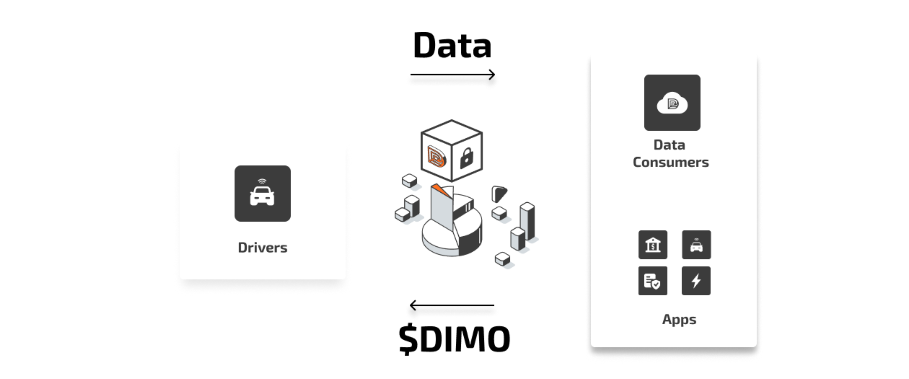
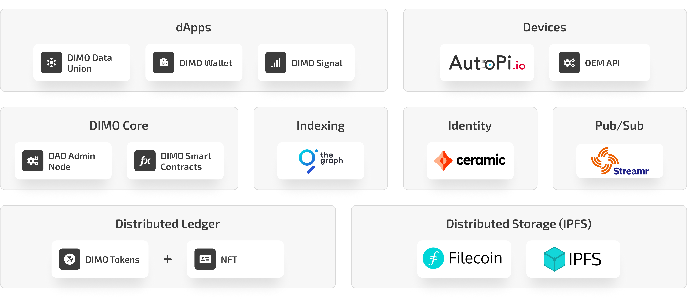

# Intro to DIMO

DIMO connects data **producers** (like cars) and **consumers** (applications and businesses) to unlock next generation mobility services.&#x20;

**Vehicle owners** use DIMO to get more out of their cars. The platform allows them to collect, use and monetize the data from their vehicles.&#x20;

**Businesses &  Developers** can access this data to build apps and services on a stable, open platform - reducing the cost of building integrations and allowing them to focus on delivering value to users.

DIMO is built in the open with open source components. This approach will unlock levels of transparency, privacy, composability, and reliability in IoT networks - increasing user and developer trust in connected devices and services.

