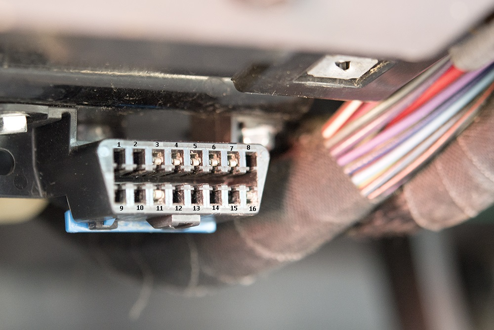

# Getting Started with DIMO


If your having trouble with Installation you can email support@dimo.zone


### Locate the ODB II Port

This specialized data port is usually under the dashboard below the steering wheel, but you may find it in a few other locations depending on your car. If you need help finding it, [click here](https://www.carmd.com/obd-port-location/).

#### What you’re looking for&#x20;

The port can be hard to find in some vehicles, but you should see a trapezoid shape with two rows of “pins.”

### Connecting

If the port is easily accessible and out of the way when you’re driving, plug the AutoPi directly into the port. If it’s hard to reach or if the AutoPi is obtrusive to driving, use the extension cord and you can then place the AutoPi in a more secure position.

**Once the AutoPi is plugged in, it will power on automatically. It will connect via our cellular network and it will configure itself for your vehicle based on the information you provided.**

### Securing the AutoPi

While the AutoPi is auto-configuring, use the provided double-sided tape to secure the AutoPi in a place where it won’t distract you while driving. We recommended options:

1. Attach below the steering column
2. Attach to dashboard
3. Route through floormat and store in the **** rear seat pocket
4. Plug directly into port (usually not ideal)

### Book a time

As an alpha-tester, we want to hear from you about the installation experience. In addition, to show you some of your own data before the DIMO app is built out, we would need to schedule a call.
