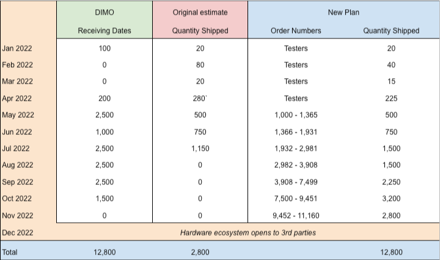
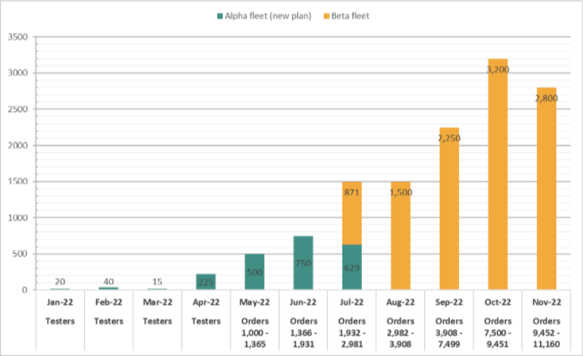

# Hardware Ecosystem

The Digital Infrastructure Inc and AutoPi teams are working as hard as possible to meet this timeline for shipping hardware from presales, and opening up additional supply for users.&#x20;

On March 4th the team announced a clarification to the process by which hardware rewards are calculated.&#x20;


For users who preordered a device: _We are going to treat **the date a user ordered** their DIMO Data Miner as the date their rewards begin (as long as they plug in and stay connected for 3 months)._ This will give hardware and distribution teams the ability deliver the best quality product on time, and our earliest supporters won't miss out.


UPDATE 3/31/22 - We have updated our shipping timeline located in the graphs below. We have decided to delay our shipping table by 1 month at the most. This was due to the 300 first devices having a ATECC108A chip, and future devices, including any manufactured by 3rd party manufacturers, will have a NXP SE050 chip (our secure element).

We are expecting to work past this issue and getting back on track to our original schedule! we are still planning on shipping all Alpha Fleet orders by June/July

If you'd like to build a hardware device in the DIMO ecosystem, please [reach out via this form. ](https://forms.gle/8BMFijTzVoGycGnZ9)
