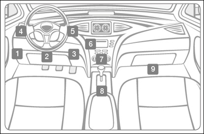

# How to install your DIMO device

### **Locate the OBD2 Port** 

This specialized data port is usually under the dashboard below the steering wheel, but you may find it in a few other locations depending on your car. If you need help finding it, click [here](https://www.carmd.com/obd-port-location/). The port can be hard to find in some vehicles, but you should see a trapezoid shape with two rows of pins.

### **Select a Device Location** ****

The AutoPi is typically obtrusive to driving if not properly installed. An extension cord will allow you to get the device to a secure, and out of sight location. Make sure that the AutoPi is in a location that will not hurt you, in the event of a crash. Do not put this device in a place where an airbag expands into or from.\
****

We recommended the following options for places to install your AutoPi Device:

1. Attach to vehicle trim below steering column
2. Attach directly to dashboard (not ideal in hotter climates with direct sunlight)
3. Route under the floor mat and store in rear seat pocket
4. Store inside vehicle trim (may require some removal/replacement)\

Once you’ve found the ideal location for the device, first use the provided alcohol swab to wipe down the area, then use the provided double-sided tape to secure the AutoPi in the swabbed area

### **Using An Extension Cable** 

\
Once the AutoPi is plugged in it will power on/off automatically, (sometimes you will need to start your vehicle). The device automatically hibernates at 12.4 volts, and shuts off at 12.3 volts. You may see lights flashing when you shut your vehicle off, but this will not kill your battery. It’s just temporary.\
\
The AutoPi Miner then connects via 4G and configures itself for your vehicle. This may take up to 15 minutes, and you may need to drive around if you’re in an area with poor cell coverage.

## Install Video coming soon.&#x20;
