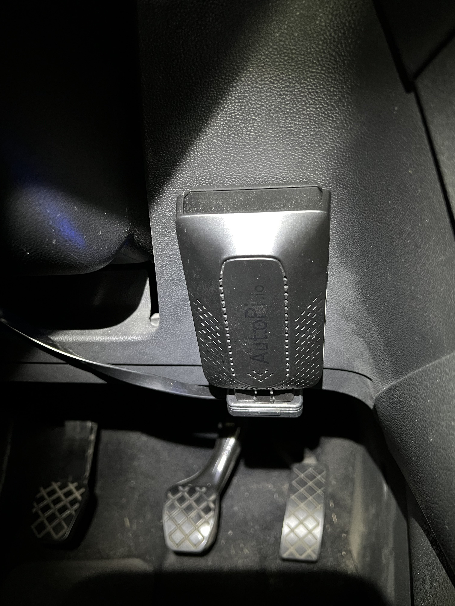
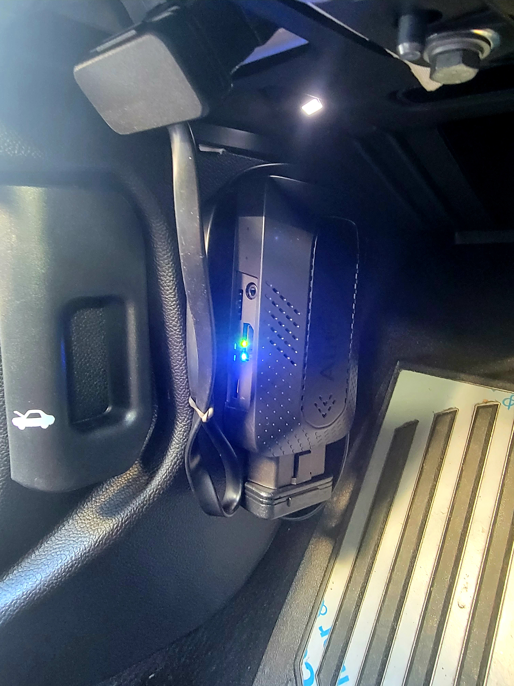
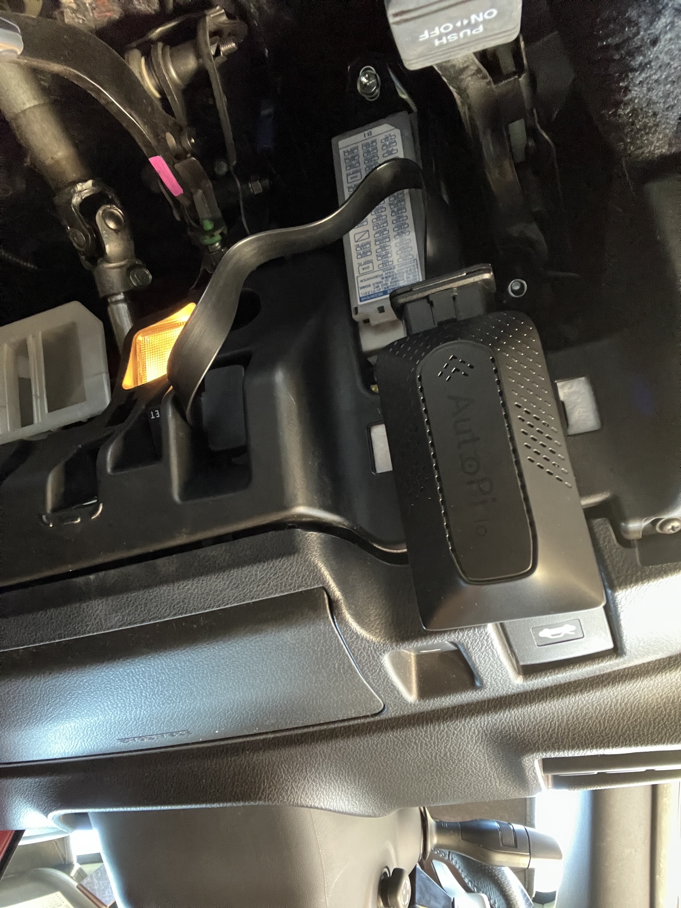
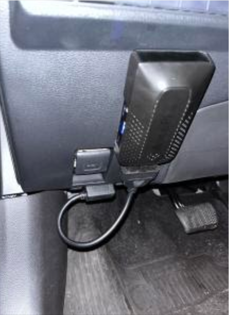
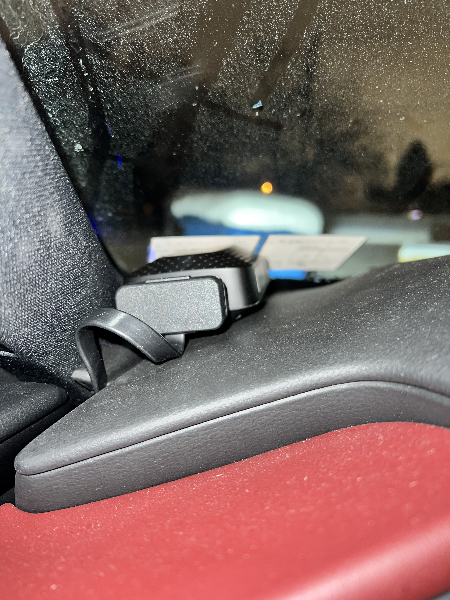
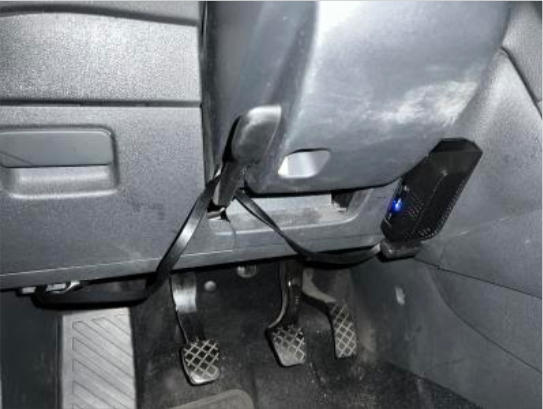
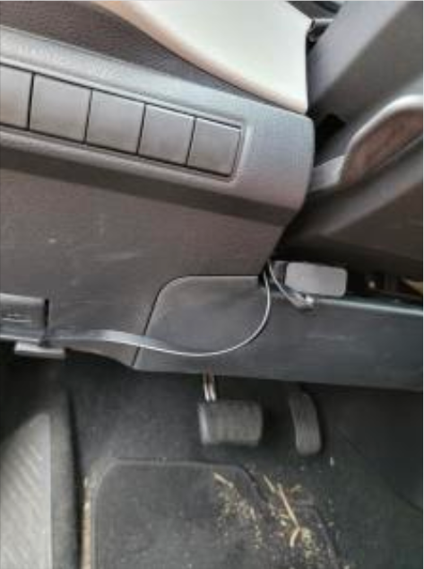
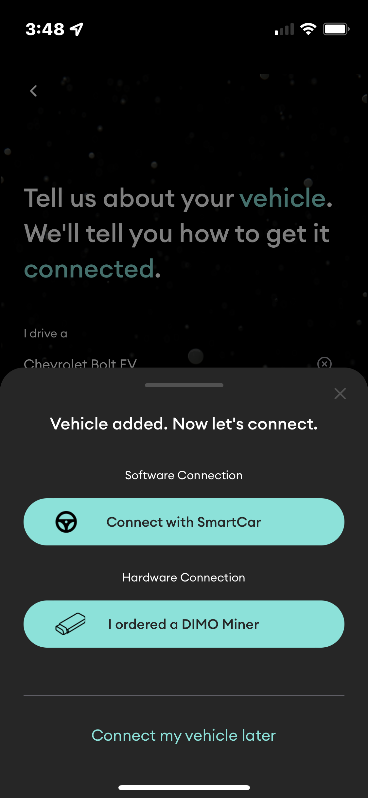
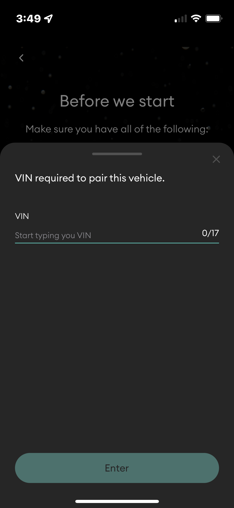

# DIMO Device Installation Instructions

<mark style="color:blue;"></mark>[<mark style="color:blue;">READ: Before you Start</mark> ](whats-included.md#before-you-start-warnings-and-key-info)<mark style="color:blue;"></mark>

* <mark style="color:blue;"></mark>[<mark style="color:blue;">Step 1: Check the Contents of Your Package</mark> ](whats-included.md#step-1-check-the-contents-of-your-package)<mark style="color:blue;"></mark>
* <mark style="color:blue;"></mark>[<mark style="color:blue;">Step 2: Watch the Installation Video</mark>](whats-included.md#step-2-watch-the-installation-video)<mark style="color:blue;"></mark>
* <mark style="color:blue;"></mark>[<mark style="color:blue;">Step 3: Install the Device and Pair in the DIMO Mobile App</mark>](whats-included.md#step-3-install-the-device-and-pair-in-the-dimo-mobile-app)<mark style="color:blue;"></mark>
* <mark style="color:blue;"></mark>[<mark style="color:blue;">Step 4: Get going!</mark>](whats-included.md#step-4-get-going)<mark style="color:blue;"></mark>

## Before you Start: 🚨Warnings and ⚠️Key Info

### Getting Help from a Person

* Run into problems? Email support@dimo.zone or come to Discord.
* Do you want to book a time to speak with someone? [<mark style="color:blue;">Book a time</mark>](https://calendly.com/d/drm-89h-kbx/install-support-call?month=2022-05).

### Warnings

* You're early! The install process may not be perfect and there may be some kinks to iron out.
* Do not put this device on an airbag panel.

### Other things to Know

* **How the AutoPi Operates.** Once the AutoPi is plugged in it will power on/off automatically. The device automatically hibernates at 12.4 volts, and shuts off at 12.3 volts to protect your battery. It will update its own software automatically when we push new updates.&#x20;
* **Lights on the AutoPi**. The lights on the AutoPi may stay on or flash when you shut your vehicle off, but this will not kill your battery. It’s just temporary and the AutoPi will hibernate.
* **Unusual Occurrences**. If you notice anything unusual after plugging in your device like a check engine light, we want to hear from you. Between AutoPi and DIMO, there are thousands of devices in the field, and we're confident this will not impact your vehicle operations, but we can help troubleshoot and make sure everything is normal and alarms clear.&#x20;
* **How the device works.** We won't cover that here, but if you'd like to learn more, [<mark style="color:blue;">click here</mark>](https://blog.dimo.zone/understanding-your-dimo-miner-and-its-data/)<mark style="color:blue;">.</mark>
* **What cars can connect**? We only support vehicles 10 years old and newer.&#x20;

✅ All good? Let's get going!

## Step 1: Check the Contents of Your Package

In the box you should have received the following items:

* **DIMO Miner** SIM card is already installed and active)
* **OBD2 extension cord** for the DIMO Miner to find a comfortable mounting position
* **Alcohol swab** for cleaning the area that you will mount your device)
* **Velcro / 3M Adhesive Tape** for mounting the device to a safe space in your car)
* **Informational card** with QR codes that link to: (1) the DIMO Mobile App and (2) these instructions here
* **DIMO Stickers** just for fun!

To see what the contents of your box should look like, click here:


If you think anything is broken, defective or missing, please email support@dimo.zone. We can help you evaluate and if necessary get you a packing/return slip, as this will not be included in the package.


✅ If everything looks good, let's move on to the next step!

## Step 2: Watch the Installation Video

#### Full Installation Overview Video



#### Pairing Process Recording

✅ Got all that? You can read through it all below:

## Step 3: Install the Device and Pair in the DIMO Mobile App

* <mark style="color:blue;"></mark>[<mark style="color:blue;">Locate Your OBD2 Port</mark>](whats-included.md#1-locate-the-obd2-port)<mark style="color:blue;"></mark>
* <mark style="color:blue;"></mark>[<mark style="color:blue;">Select a Device Location with your Extension Cable</mark>](whats-included.md#2-select-a-device-location-with-your-extension-cable)<mark style="color:blue;"></mark>
* <mark style="color:blue;"></mark>[<mark style="color:blue;">Follow the Pairing Process in the DIMO Mobile app</mark>](whats-included.md#3-follow-the-pairing-process-in-the-dimo-mobile-app.)<mark style="color:blue;"></mark>

### **3.1: Locate Your OBD2 Port**&#x20;

This specialized data port is usually under the dashboard below the steering wheel, but you may find it in a few other locations depending on your car. Refer to this picture for areas on where the port might be:  (click to expand)\
\
The port may be hard to find in some vehicles, but you should see a trapezoid shape with two rows of pins that looks like this:  (click to expand)


If your port is hard to find. you can click <mark style="color:blue;"></mark> [<mark style="color:blue;">here</mark>](https://www.carmd.com/obd-port-location/) for help.&#x20;


### **3.2: Select a Device Location with your Extension Cable**


You may want to complete the process of mounting the device until after the completing the pairing as you will need to be able to scan the barcode and check the lights on the device. &#x20;


After locating your OBD2 port, you may want to sit in the drivers seat to find your ideal mounting location. &#x20;

We recommended the following options for places to install your DIMO Device. It's up to you where you would like to place it:

_Click the pictures to see them full size._

* Attach to vehicle trim below steering column
* Attach directly to dashboard (not ideal in hotter climates with direct sunlight)
* Route under the floor mat and store in rear seat pocket
* Store inside vehicle trim (may require some removal/replacement)


Plugging in your DIMO device directly to your OBD2 may result in a loose connection. This may cause issues with data accuracy, engine lights, or detachment from the OBD2 port. \
\
**We recommend you use an extension cable.** If the one supplied is not a suitable length, you can order an OBD2 cable of a different length on many sites, including Amazon.


**You can come back here after the Mobile App Pairing Process.** Once you have found your ideal location for mounting, wipe the area down with the included alcohol wipe. Attach the included Velcro or 3M tape to the device. Attach one end of the extension cable to the device and then plug in the other side into your OBD-2 port. Mount the device to your vehicle.&#x20;

### Good Mounting Examples



    

 





.png>)







### Poor Mounting Examples



 







### 3.3: Pairing Process in the DIMO Mobile app.&#x20;


You can download the IOS app [<mark style="color:blue;">here</mark>](https://apps.apple.com/us/app/dimo-mobile/id1589486727) <mark style="color:blue;"></mark> and the Android app [<mark style="color:blue;">here</mark>](https://play.google.com/store/apps/details?id=com.dimo.driver).&#x20;


#### **3.3.1) Create an Account and Add Your Car**

If you already have an account and have added your car, click here to jump to [<mark style="color:blue;">3.3.2 Pair your Device</mark>](whats-included.md#c-2-begin-pairing). ****&#x20;

* Open the DIMO Mobile app on your iPhone or Android device and create an account. **If you create an account with your email address, you can add a crypto wallet later.**  ****
* Welcome to the DIMO app, you will now be on the home screen, You will need to add your first vehicle here. Let's hit the + add a vehicle button.  Read the Acknowledgement and hit the button! 
* Tell us about your vehicle! Type in the make and model of your vehicle and select it from the drop down list. You will now select the year of your vehicle and click the Add vehicle button! Select connect with a DIMO miner. Now we can start pairing!&#x20;


Verify you have all of the following before continuing. 

* Your phone has stable internet connection via Wi-Fi or cell service.
* You have access to the vehicle that you want to use your hardware with.&#x20;
* (optional) A working camera on your mobile device&#x20;
* If you do not have a working camera or you cannot get the barcode to scan\
  you can input the device ID manually in the app


#### 3.3.2) Pair Your Device&#x20;

* &#x20;**** Tap your vehicle in your home screen, and select connect with a DIMO miner 
* &#x20;**** Add in your vehicle's 17 character VIN and click “Enter”. Click [<mark style="color:blue;">here</mark>](https://autotrends.org/2016/11/29/where-is-my-vin-number-located/) <mark style="color:blue;"></mark> for help finding your VIN 
* &#x20;**** Locate the barcode on the left side of your DIMO device, and select "Scan my barcode" in the mobile app. 
* Scan the barcode on your device, if successful you will see a checkmark in your app. 
* Plug in your DIMO Miner into the OBD-II port in your vehicle and start your vehicles ignition.
* Wait for your device to power one and show both a solid green and blue light.&#x20;
* Once you have verified both lights are on and solid select “I’m plugged in” to continue. 
* You're all set up! Your DIMO miner is fully configured. You'll now see your data show in your mobile app 


The DIMO Miner connects via 4G cell service and configures itself for your vehicle. This can awhile to connect if you are in an area with poor cell coverage. You may need to drive somewhere for a stronger connection. A solid green light means it has connected/&#x20;


## Step 4: Get going!&#x20;

Congratulations! You have just paired your first DIMO device. You have taken your first step in owning your data. You can learn more about rewards [<mark style="color:blue;">here</mark>](broken-reference). You can learn more about how your data can be used [<mark style="color:blue;">here</mark>](../overview/starting-with-cars.md). You can learn how to claim your NFT [<mark style="color:blue;">here</mark>](broken-reference).

