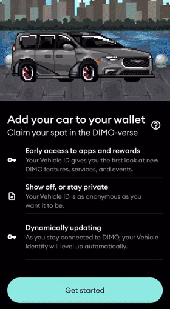

# DIMO Vehicle Composer


You must have a Software or Hardware connection to your vehicle before you are given access to the composer feature


The DIMO Vehicle Composer allows a user to customize and create their open vehicle ID.\
There are currently over 10,000 possible combinations you can use to express yourself through your Open Vehicle ID.  \
\
A user can customize the vehicle with the following options&#x20;

* Body
* Wheels
* Kit
* Extras
* Scene

