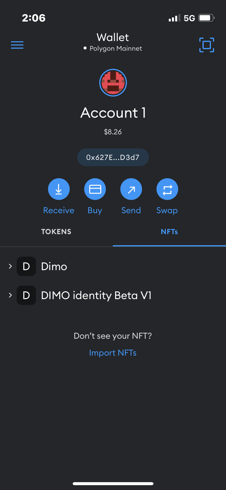
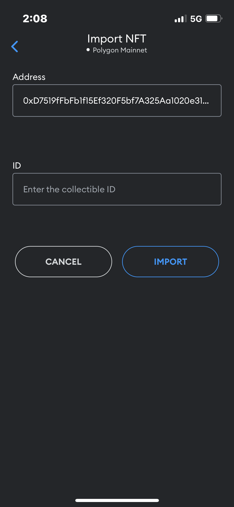
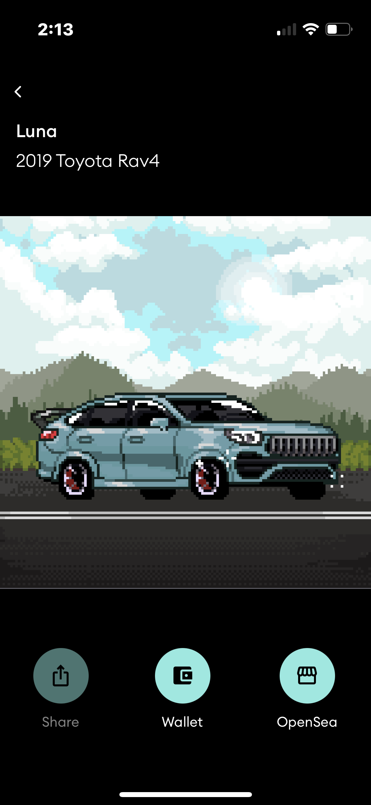

# How to import your Open vehicle ID to your web3 wallet

### MetaMask 

Log into your MetaMask wallet mobile app

Click on the NFT tab and select import NFT at the bottom 

Input Contract address 0xD7519fFbFb1f15Ef320F5bf7A325Aa1020e31988 in the address box \
\
Input your Token ID found on the DIMO Identity Beta V1 OpenSea site.

You should now see your Open Vehicle ID in your app&#x20;


You can find the link to your vehicle on OpenSea in your mobile app 


### Argent

### Trust Wallet

### Rainbow
