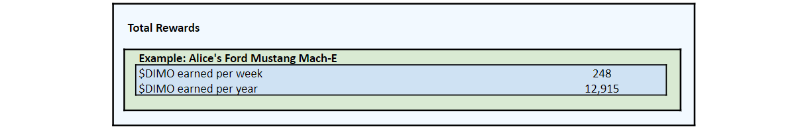

# Demand Signal

Driver rewards will be based on a combination of baseline and market demand for vehicle data and connectivity.&#x20;

**Baseline Demand Signal** refers to the concept of rewarding drivers based on how long they've been connected, what type of car they drive, and what types of data they provide, even if there is no end customer using their data. **This will be the sole driver issuance mechanic initially**. The goal here is to prime the network by incentivizing drivers to connect the types of cars and stream the types of data that we expect will be valuable to data consumers and app developers in the future.

**Market Demand Signal** refers to rewarding drivers based on what third parties are paying for their data. E.g., if Acme Corp subscribes to Alice's data for $10/month, Alice receives $10/month less a small protocol fee or burn (amount TBD).

In the early stages of DIMO's development, the vast majority of rewards will come from Baseline Demand Signal. As the network grows, this balance will likely shift the other way. This is comparable to other web3 networks like Helium, where their rewards from proof of coverage will shrink in comparison to rewards from data transfer over time.

### Rewards from Baseline Demand Signal

450,000,000 $DIMO (45% of the total supply) will be allocated to fund the Baseline Demand Signal reward pools. These pools will be issued over 40 years by issuing 1,300,000 $DIMO to users per week for the first year, with issuance decreasing by 15% each year. For more on the allocation and distribution curve over time, read [Token Distribution](token-distribution.md).

As implied above, the goal here is to allow actual market demand to gradually supplement and replace baseline demand, thus reducing and removing the need to inflate the circulating supply of $DIMO in perpetuity.

A weekly issuance was chosen because driving behavior varies dramatically by time of day (i.e., it’s concentrated during peak commuting hours). If the issuance protocol were to distribute $DIMO by the hour, then drivers would be under-compensated during rush hour (as the reward would be split between a high percentage of drivers) and overcompensated for driving at 3AM. A weekly issuance allows for a predictable issuance schedule, transaction fee optimization, and relatively frequent rewards distributions without incentivizing abnormal driving behavior.

To start, two different [dTeams](../governance/dteams.md) will oversee the distribution of baseline rewards. dCore will facilitate the distribution of half of the 1,300,000 $DIMO issued weekly. dGreen will facilitate the distribution of the other 650,000 $DIMO per a separate rewards formula aimed at incentivizing pro-social behavior.

.png>)

Once the token distribution goes live on mainnnet, the weekly issuance will be allocated per the following methodology from each pool. $DIMO token holders can vote to alter these rewards formulas, alter the issuance amounts, and create new pools at any time by [voting](../governance/voting.md).&#x20;

In year one, the Core rewards pool will issue 650,000 $DIMO per week to all DIMO users based on how many points they've earned relative to other users. In other words, if you earn 1% of the points in a given week, you also get 1% of the tokens distributed that week. Drivers earn points based on the quality and duration of their data connection. **Both gas and electric vehicles are eligible to earn tokens from the Core rewards pool.**

Our aim is to:

* Reward and give control to those who show long-term support for DIMO;
* Incentivize a continuous data connection, which tells a fuller story of driver behavior and vehicle performance when maintained over a long-period of time;
* Reward those who provide a greater quantity and frequency of reliable data; and
* Avoid rewarding based on distance or time traveled as not to incentivize unnecessary and wasteful driving.

In the example shown in the table above, there are 10,000 cars connected to DIMO and each car generates an average of 6,000 points that week. Therefore, a total of 60,000,000 points are generated by the users in this pool. To convert points into tokens, we divide the 60,000,000 points by the 650,000 $DIMO tokens issuance to calculate an exchange rate of approximately 92 points per 1 $DIMO token. Each week, this exchange rate will change based on the total number of points generated.

Alice earns 2,000 points for having been connected between 20 to 36 weeks and 7,500 points for having a [DIMO Data Miner](https://shop.dimo.zone) installed in her vehicle which has already been [decoded](https://github.com/DIMO-Network/opendbc). She has earned 9,500 points in total this week in the dCore pool. Given the exchange rate of approximately 92 points per token, we can calculate that she will be sent just over 103 $DIMO from this pool (9,500 points ÷ 92 points per token).

.png>)

**Unlike Core, the Green rewards pool is only available to drivers with electric vehicles, including plug-in-hybrids**. It issues another 650,000 $DIMO per week in year one. Gas cars and hybrids that don't have plug-in charging will not be eligible to earn rewards from this pool.

In the example above, there are 5,500 electric and plug-in hybrid vehicles connected to DIMO earning an average of 6,500 points each. This means there is a total of 35,750,000 points generated by electric vehicle owners and the exchange rate in this pool is 55 points per 1 $DIMO token (35,750,000 points ÷ 650,000 tokens).

The Mach-E is a 100% electric vehicle so she earns 5,000 points. Also, there are only 40 other 2021 Mustang Mach-E's connected to DIMO this week so she earns another 3,000 points for the rarity of her car. In addition to encouraging eco-conscious decisions, dGreen also wants to incentivize a broad sample of electric vehicles to connect. After 51 2021 Mustang Mach-E's connect to DIMO, she'll only earn 1,000 points per week for her car's rarity from that point forward, not 3,000.

We calculate Alice's token earnings by taking her 8,000 points and dividing them by 55 points per token, which gives us her earnings of 145 $DIMO from the dGreen rewards pool.

Across both pools, Alice earned approximately 248 $DIMO in a week. If she continued to earn that amount each week, she would end the year with 12,915 tokens from her Mach-E.

Curious how this would play out for people besides Alice? The table below shows earnings for a small sample of hypothetical drivers in the same hypothetical week. This is meant to be illustrative using a small handful of made up users, not an exhaustive list of every combination of attributes.

.png>)

### Market Demand Signal

The exact launch timeline and methodology for distributing passthrough rewards from actual market demand will be determined by a future vote of $DIMO token holders.

Generally, we expect such a program to entail $DIMO flowing from data customers to data producers (drivers and fleet operators) based on the usage of their vehicle data and connectivity. This arrangement would be based on rates that the DAO negotiates with data consumers, who will most often be Data Unions (brokers). There will also be a small percentage of $DIMO that will be funnelled to the DIMO Foundation to fund future development or burned with each data sale transaction (exact terms TBD).

### Withdrawing rewards 

Initially, DIMO will require a 7-day delay to withdraw tokens so various automated security checks can be performed. This will allow the DAO to challenge the authenticity of the data and validate that no duplicate or malicious actors are sending data into the network. This delay will not impact the availability of tokens for voting purposes. We hope to shorten and possibly eliminate this time lock with improved data verification protocols.

_The contract address for $DIMO is 0x5fab9761d60419c9eeebe3915a8fa1ed7e8d2e1b. Please always confirm that you are interacting with this contract address and not that of a fraudulent imitator. This webpage is making no guarantees about the nature of the DIMO DAO or the $DIMO token or its distribution, which are subject to change based on continued legal, tax, and other design considerations. $DIMO will launch as a governance token with no claim on financial rights and no economic value. Please triple check that any communications from DIMO are authentic as it’s common for scammers to try to trick you into sending them crypto or into revealing your private keys._
